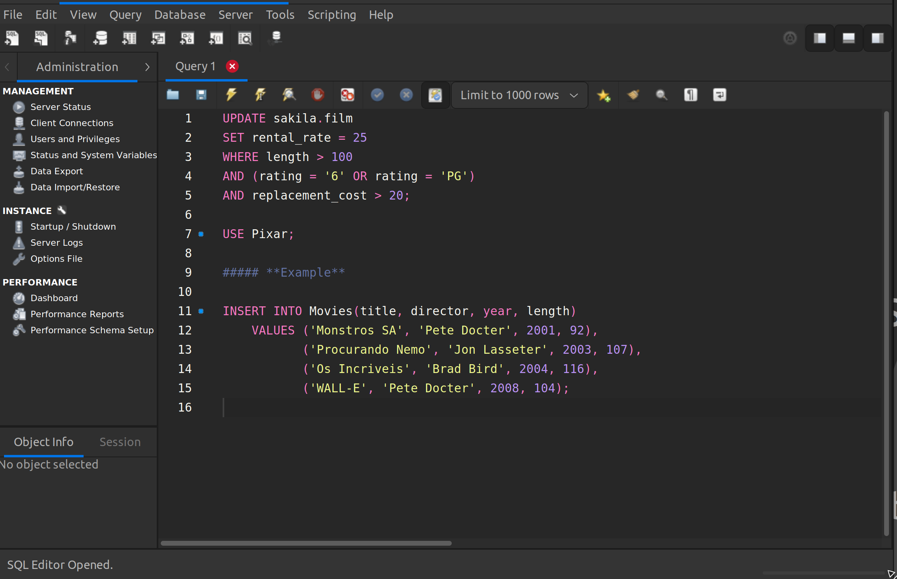

# Dark theme for [MySQL Workbench](https://www.mysql.com/products/workbench/)

> A dark theme for [MySQL Workbench](https://www.mysql.com/products/workbench/)




### Install using Git
If you are a git user, you can install the theme and keep up to date by cloning the repo:

```sh
git clone https://github.com/mervick/dark-mysql-workbench.git
```

### Install manually
Download using the GitHub .zip download option and unzip them.

### Activating theme
*Using Windows*

- Copy the code from the `copy.xml` file
- Go to `C:\Program Files\MySQL\MySQL Workbench 6.3 CE\data`
- Open `code_editor.xml`
- Paste the code you've selected before inside the tag `<language name="SCLEX_MYSQL">`, replacing all styles in that tag
- Open your MySQL Workbench and be happy!

*Using Ubuntu*

- Copy the code from the `copy.xml` file
- Go to `/usr/share/mysql-workbench/data`
- Open code_editor.xml
- Paste the code you've selected before inside the tag `<language name="SCLEX_MYSQL">`, replacing all styles in that tag
- Open your MySQL Workbench and be happy!

*Using Mac*

- Copy the code from the `copy.xml` file
- Go to `/Applications/MySQLWorkbench.app/Contents/Resources/data/code_editor.xml` (to open the contents of the app right click on the workbench app and select 'Show Package Contents')
- Open `code_editor.xml`
- Paste the code you've selected before inside the tag `<language name="SCLEX_MYSQL">`, replacing all styles in that tag
- Open your MySQL Workbench and be happy!

## License

[MIT License](./LICENSE)  
This repo is a fork of [dracula mysql-workbench](https://github.com/dracula/mysql-workbench)  

